# 📦 @goodandready/dsh-vision-bridge

<div align="center">

<h3>Universal Vision Bridge for DeepSeek Harness: Seamless Multimodal Attachments with Text-Only Chat Models</h3>

<p align="center">
  <a href="https://www.npmjs.com/package/@goodandready/dsh-vision-bridge"></a>
  <a href="LICENSE"></a>
  <a href="https://github.com/topics/dsh-plugin"></a>
  <a href="https://nodejs.org"></a>
</p>

<!-- Showcase Button -->
<p align="center">
  <a href="https://goodandready.app/"></a>
</p>

<p align="center">
  <a href="README.md"><b>🇬🇧 English</b></a> •
  <a href="README.ru.md"><b>🇷🇺 Русский</b></a> •
  <a href="README.zh.md"><b>🇨🇳 中文说明</b></a>
</p>

</div>

---

## ⚡ Overview & The Problem

When interacting with text-only LLM models (e.g. `deepseek-v3`, Qwen text-only variants) in **DeepSeek Harness**, users cannot natively attach and send images:

1. In **DSH 0.1.2-alpha.2+**, the core session controller performs a strict server-side modality check (`ctx.llm.resolveModelInfo`). If the active conversation model lacks `image` in `inputModalities`, the prompt is immediately rejected with a `session/attachment-invalid` error ("Model does not support image input").
2. Standard text-only adapters throw errors when encountering raw multimodal image blocks in their message payload.

### How `dsh-vision-bridge` Solves This

`dsh-vision-bridge` acts as an intelligent intermediary inside the Cordis runtime:
* **Server-Side Modality Bridge (v0.5.3+)**: Decorates `ctx.llm.resolveModelInfo` and `ctx.llm.listModels` so the session controller accepts image attachments on all models when bridging is active.
* **Automatic Image Rewrite (`agent/pre-step` & `llm/stream`)**: Automatically intercepts image blocks, routes them to a configured vision model (e.g. Gemini, Claude, Qwen-VL, or local Ollama), receives a descriptive synthesis, and rewrites the image block into text context `[The user attached an image. Description: ...]` before handing it to the text-only chat model.
* **Native Passthrough**: Automatically detects models that natively support vision and allows images to pass directly without unnecessary rewriting.
* **Rich Visual Tool Suite**: Exposes ~40 specialized tools for on-demand OCR (incl. local Tesseract), visual question answering, bounding-box grounding, document/table/formula extraction, QR/barcode reading, UI-flow reconstruction, multi-model consensus and more. `vision_consensus` is opt-in via the `consensusEnabled` setting.

---

## 🏗️ Architecture

```mermaid
graph LR
    User["User attaches Image in Web UI"] --> Gateway["DSH Session Controller"]
    Gateway --> BridgeCheck{"Modality Bridge (v0.5.3)"}
    BridgeCheck -->|"Augments inputModalities"| SessionAllowed["Prompt Accepted"]
    SessionAllowed --> Hook["agent/pre-step Hook"]
    
    Hook --> CheckNative{"Does chat model support vision natively?"}
    CheckNative -->|"Yes (Native Passthrough)"| NativeLLM["Send Raw Image to Chat LLM"]
    CheckNative -->|"No (Text-Only)"| VisionRouter["Vision Bridge Channels"]
    
    VisionRouter --> VisionModel["Dedicated Vision Model\n(DSH / OpenAI / Ollama / Webhook)"]
    VisionModel --> Description["Generated Text Description + OCR"]
    Description --> Rewrite["Substitute Image with Text Marker"]
    Rewrite --> ChatModel["Send Enriched Text to Chat LLM"]
    ChatModel --> Answer["Assistant Response in Chat"]
```



---

## ✨ Key Features

### 1. Processing Modes
* **`hybrid` (default)**: Automatically describes attached images in chat turns while keeping all ~40 explicit vision tools available for follow-up reasoning.
* **`llm`**: Pure auto-rewrite mode — images are transparently converted to text context; tools remain callable.
* **`tools`**: Auto-rewrite disabled — the chat model is expected to explicitly invoke `describe_image` or OCR tools when required.

### 2. Multi-Channel Endpoint Routing & Fallback
Chain multiple vision backends with automatic failover, parallel racing, and circuit breaker:
* `dsh-catalog`: Auto-detect or select any vision-capable model already registered in DSH.
* `openai-compatible`: Standard OpenAI-compatible vision endpoints (vLLM, SGLang, OpenRouter, etc.).
* `ollama`: Auto-discovery and local inference through Ollama vision models (e.g. `minicpm-v`, `llama3.2-vision`).
* `webhook` / `custom`: External HTTP or JSON-RPC vision endpoints.

### 3. High-Performance LRU Description Cache
Caches vision responses by `hash(bytes + prompt + model + mode)` to eliminate redundant vision API calls and save token quota on repeated questions about the same image.

### 4. Comprehensive Visual Tool Inventory (~40 Tools)

| Tool Category | Tools | Description |
|---|---|---|
| **Core** | `describe_image`, `read_image`, `inspect_image` | General image analysis by attachment ID, file path, or URL. |
| **Geometry & Detection** | `vision_ground`, `vision_crop`, `vision_detect`, `vision_compare`, `vision_present` | Bounding box coordinates (0–1000 scale), object inventory, multi-image comparison. |
| **OCR & Text** | `vision_ocr`, `vision_ocr_local`, `vision_long_ocr`, `vision_trace`, `vision_colors`, `vision_extract_foreground` | Transcription, local Tesseract OCR (offline), long screenshot stitching, SVG tracing, color palettes. |
| **Structured & UI** | `vision_describe_structured`, `vision_vqa`, `vision_ui_layout`, `vision_translate_image` | JSON breakdown (`{summary, ocr, layout, entities}`), short VQA, UI section analysis. |
| **Pixel & Diagnostics** | `vision_pixel_diff`, `vision_quality_check` | Semantic visual diff, quality scoring (blur/lighting). |

---

## 📦 Installation

```bash
dsh plugin --profile web add @goodandready/dsh-vision-bridge
```

After installation, restart the DSH Web UI. The configuration card is available under **Settings → Plugins → vision-bridge**.

---

## ⚙️ Configuration (`settings.yaml`)

```yaml
dsh-vision-bridge:
  # Operation mode: 'hybrid' | 'llm' | 'tools'
  mode: hybrid
  
  # Auto-detect vision model or specify provider/model explicitly
  visionProvider: ""
  visionModel: ""
  
  # Allow vision models to receive images natively without rewriting ('prefer' | 'never' | 'always')
  nativePassthrough: prefer
  hideRedundantTools: true   # hide bridge tools when the chat model already sees images
  attachMaxItems: 8          # pages/frames/files one attach call may publish
  
  # Enable LRU description cache
  cacheEnabled: true
  cacheMaxEntries: 200
  
  # Request timeout in milliseconds
  timeoutMs: 120000
  
  # Multi-channel routing configuration
  channels: []
  channelFallback: sequential # 'sequential' | 'parallel-race'
```

### Parameter Reference

| Parameter | Type | Default | Description |
|---|---|---|---|
| `mode` | `string` | `"hybrid"` | Processing mode (`hybrid`, `llm`, `tools`). |
| `visionProvider` | `string` | `""` | ID of the vision provider (empty = auto-detect). |
| `visionModel` | `string` | `""` | ID of the vision model (empty = auto-detect). |
| `nativePassthrough` | `string` | `"prefer"` | Behavior for native vision models (`prefer`, `never`, `always`). |
| `hideRedundantTools` | `boolean` | `true` | When the chat model supports images natively, hide the compensation tools from that agent and keep only the extra instruments. |
| `attachMaxItems` | `number` | `8` | Maximum images one `vision_attach_*` call publishes (PDF pages, video frames, files). Hard ceiling 32. |
| `cacheEnabled` | `boolean` | `true` | Enables LRU caching for descriptions. |
| `cacheMaxEntries` | `number` | `200` | Maximum number of cached items in memory. |
| `timeoutMs` | `number` | `120000` | Execution timeout in milliseconds. |
| `channelFallback` | `string` | `"sequential"` | Channel routing (`sequential`, `parallel-race`); ordering via `channelOrderMode`. |

---

## 📝 Changed in v0.5.30

Security and honesty release. Additive summary of what changed for users:

* **SSRF fetch policy**: model-supplied image URLs (`describe_image` urls, `inspect_image`, and the headless-chrome tools) are now fetched only through a policy layer — non-http(s) schemes, localhost names and private/loopback/link-local hosts (incl. IPv4-mapped IPv6 and NAT64) are refused on every redirect hop; bodies are capped. New setting `allowedUrlHosts` (exact-hostname allowlist) deliberately re-allows an internal endpoint.
* **`apiKeyRef`**: channels can reference a credential-service entry or environment variable BY NAME — plaintext API keys are no longer required in `settings.yaml`. Existing inline `apiKey` values keep working; masked-key preservation on save now matches channels by identity, not position.
* **Route guards**: `POST /bench`, `POST /batch`, `DELETE /batch/:id`, `DELETE /journal`, `DELETE /cache` now require same-origin like the other mutating routes. `GET /doctor` is static by default; channel probes run only with `?probe=1` (same-origin required).
* **Settings honesty**: `maskPII`, `stripEXIF`, `auditLog` and `consensusEnabled` are now wired end-to-end. The previously decorative `blurFaces`, `nsfwFilter`, `tileLargeImages`/`tileThreshold` toggles and the no-op Local/Cloud/LM Studio presets were removed. Changed in v0.5.30: if you relied on them, note they never had an effect.
* **English source language**: all user-facing strings are English; the bundled Russian dictionary was removed — the translation plugin supplies Russian at runtime.
* **Core split**: the pure kernel (config schema + helpers) moved to `lib/vision-core.js`; `lib/index.js` re-exports it — no API changes. `describe_image` lost a v0.5.13 regression that returned an empty description; `vision_annotate` works again; pHash caching no longer mixes up similar images.

---

## 📝 Changed in v0.5.31

Maintenance release — no user-facing behavior changes.

* **Internal structure**: tool registrations moved to `lib/tools/*` domain modules (core / grounding / ocr / document / analysis / media); `lib/index.js` re-exports everything as before. Smaller files, explicit dependencies between the host and the tool domains.
* **Settings card hardening**: locale registration is fault-tolerant, the redundant sidebar fallback was removed, plugin service access goes through a safe `ctx.get` wrapper, and `/config` accepts the expanded field set (`cacheMaxEntries`, `channelFallback`).

---

## 📝 Changed in v0.5.32

Stability and architecture release.

* **Internal structure**: all ~44 tool registrations moved to `lib/tools/*` domain modules (core / grounding / ocr / document / analysis / media) with explicit dependencies; `lib/index.js` keeps the host wiring only.
* **Stability fixes**: finished batch records are released after a 10-minute poll window (memory growth fixed); `/upload-pdf` rejects payloads above the new `maxPdfBytes` setting (20 MiB default) instead of buffering arbitrary bodies; `vision_memory_search` scores each attachment against its own description (previously all attachments matched identically); dead host code removed; journal labels are consistent between the legacy and channels paths.
* **Settings**: new `maxPdfBytes` setting (upload hard cap).

---

## 📄 License

MIT © [GooDAnDReaDY](https://github.com/GooDAnDReaDY)

### 15. 🛡️ Enterprise Security & Settings Governance (`v0.5.27`)
* **Masked Secrets**: `GET /channels` automatically masks sensitive provider API keys (`sk-p...7890` or `********`) and reports `hasApiKey: true` to prevent secret leakage in browser DevTools/XHR. `POST /channels` preserves existing keys when a mask is submitted.
* **CSRF & Origin Guard**: All mutating and cost-incurring endpoints (`/config`, `/channels`, `/upload-pdf`, `/test`, `/bench`, `/batch`, `DELETE /journal`, `DELETE /cache`, and `/doctor?probe=1`) validate `sec-fetch-site !== 'cross-site'` via `isTrustedSettingsRequest`, rejecting cross-origin attacks with `403 Forbidden`. The default `GET /doctor` report is static (no channel probes).
* **SSRF fetch policy**: model-supplied image URLs are fetched only through `safeFetch` — non-http(s) schemes, localhost names and private/loopback/link-local hosts (incl. IPv4-mapped IPv6 and NAT64) are refused on every redirect hop; response bodies are capped. Use `allowedUrlHosts` to explicitly re-allow an internal endpoint.
* **apiKeyRef**: channels may reference a credential-service entry or environment variable by NAME instead of storing a plaintext `apiKey` in settings; keys resolve at call time. `GET /channels` keeps masking values; key preservation on save matches channels by identity, not position.
* **Privacy & honesty**: `maskPII`, `stripEXIF`, `auditLog` and `consensusEnabled` settings are wired end-to-end; the previously decorative face-blur / NSFW / tiling toggles and no-op presets were removed.
* **Native settingsScope Integration**: Settings UI binds directly to `ctx.settingsScope` (`namespace: 'dsh-vision-bridge'`), supporting reactive snapshot listeners and kernel state synchronization.
