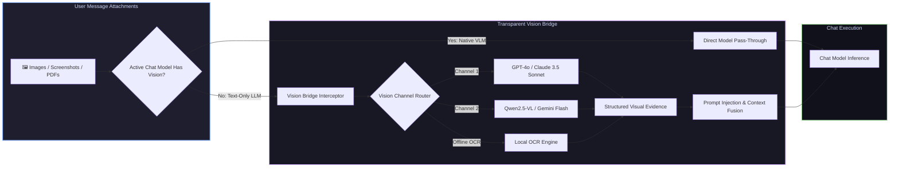

# 📦 @goodandready/dsh-vision-bridge

<div align="center">

<h3>Universal Vision Bridge, Multimodal Adapter & 27-Tool Computer Vision Suite for DeepSeek Harness</h3>

<p align="center">
  <a href="https://www.npmjs.com/package/@goodandready/dsh-vision-bridge"></a>
  <a href="LICENSE"></a>
  <a href="https://github.com/topics/dsh-plugin"></a>
  <a href="https://nodejs.org"></a>
</p>

<p align="center">
  <a href="README.md"><b>🇬🇧 English</b></a> •
  <a href="README.ru.md"><b>🇷🇺 Русский</b></a> •
  <a href="README.zh.md"><b>🇨🇳 中文说明</b></a>
</p>

</div>

---

## ⚡ Overview

**`dsh-vision-bridge`** is a comprehensive multimodal powerhouse for **DeepSeek Harness**. 

It solves two critical challenges:
1. **Universal Multimodal Bridging**: When users send images, diagrams, or PDFs to **text-only LLMs** (e.g. `deepseek-v4-flash`, `deepseek-chat`), the plugin automatically intercepts the attachments, extracts rich structured visual descriptions via a configured vision backend (GPT-4o, Claude 3.5 Sonnet, Qwen2.5-VL, Gemini 2.0 Flash), and injects the evidence seamlessly into the prompt — completely preventing `does not support image input` crashes.
2. **27 Agent Vision Tools**: Equips agents with a full suite of computer vision tools (OCR, VQA, spatial grounding, UI wireframe parsing, PDF page extraction, image diffing, and batch processing).



---

## 🛠️ Complete 27 Agent Vision Tools Matrix

`dsh-vision-bridge` registers 27 specialized tools in `ctx.tools`:

| Tool Name | Purpose | Key Parameters |
|---|---|---|
| `describe_image` | Full semantic captioning and general description | `image_path`, `detail_level` |
| `read_image` | Direct text reading and reading order extraction | `image_path`, `language` |
| `vision_ocr` | High-accuracy cloud optical character recognition | `image_path`, `detect_orientation` |
| `vision_ocr_local` | 100% offline local OCR engine | `image_path` |
| `vision_long_ocr` | Multi-column, complex document OCR | `image_path`, `preserve_layout` |
| `vision_pdf_pages` | PDF multi-page extraction, rendering & OCR | `pdf_path`, `pages`, `dpi` |
| `vision_describe_structured` | Structured JSON evidence (objects, text, colors, hierarchy) | `image_path`, `schema` |
| `vision_vqa` | Visual Question Answering on specific regions | `image_path`, `question`, `bbox` |
| `vision_ground` | Spatial coordinate & bounding box grounding | `image_path`, `query` |
| `vision_crop` | Dynamic image cropping around points or bounding boxes | `image_path`, `bbox`, `target_path` |
| `vision_detect` | Object detection, counting, and classification | `image_path`, `categories` |
| `vision_compare` | Multi-image side-by-side semantic comparison | `image_paths`, `aspects` |
| `vision_pixel_diff` | Visual regression pixel-level comparison | `image_a`, `image_b`, `threshold` |
| `vision_ui_layout` | UI wireframe parsing, element hierarchy & buttons | `image_path`, `framework` |
| `vision_translate_image` | In-image text translation with replacement | `image_path`, `target_lang` |
| `vision_colors` | Color palette extraction & dominant contrast analysis | `image_path`, `palette_size` |
| `vision_extract_foreground` | Subject isolation and background removal | `image_path`, `output_path` |
| `vision_trace` | Vector diagram, blueprint, and line tracking | `image_path`, `smoothness` |
| `vision_html_screenshot` | Render HTML/CSS directly to screenshot | `html_content`, `viewport` |
| `vision_video_describe` | Video keyframe extraction & timeline summary | `video_path`, `fps` |
| `vision_batch` | Parallel batch analysis across multiple images | `image_paths`, `task` |
| `vision_browser_snapshot` | Headless browser page snapshot | `url`, `wait_selector` |
| `vision_browser_click` | Visual coordinate-based browser click | `coordinate`, `element_text` |
| `vision_browser_navigate` | Visual web page navigation | `url` |
| `vision_present` | Visual presentation & highlight formatting | `image_path`, `highlights` |
| `vision_materialize` | Visual asset materialization & caching | `asset_ref` |
| `vision_page_persist` | Multi-turn visual context persistence | `session_id`, `state` |

---

## 🌐 Vision Channels & Supported Models

Configure multiple fallback vision channels in **Settings → Vision Bridge**:
* **Channel 1 (Primary)**: `openai` (`gpt-4o`, `gpt-4o-mini`), `anthropic` (`claude-3-5-sonnet-20241022`), `gemini` (`gemini-2.0-flash`).
* **Channel 2 (High-Speed / Low-Cost)**: `qwen` (`qwen2.5-vl-72b-instruct`), `deepinfra` (`Qwen/Qwen2-VL-7B-Instruct`), `siliconflow`.
* **Channel 3 (Offline / Local)**: Local OCR and embedded lightweight vision endpoints.

---

## 📊 Performance, Caching & Cost Monitoring

* **Disk LRU Evidence Cache**: Repeated images or identical screenshots are hashed and served from cache with **0 latency and $0 token cost**.
* **Real-time Cost & Token Tracker**: Exposes usage statistics via `GET /dsh-vision-bridge/costs` and `GET /dsh-vision-bridge/stats`.
* **Built-in Benchmark Suite**: Run latency diagnostics across all configured vision models via `GET /dsh-vision-bridge/bench`.

---

## 📦 Quick Installation

```bash
dsh plugin --profile web add @goodandready/dsh-vision-bridge
```

> [!IMPORTANT]
> Restart DSH Web UI after installation (`systemctl --user restart dsh-web`) and reload the browser tab.

---

## ⚙️ Configuration Example (`settings.yaml`)

```yaml
dsh-vision-bridge:
  enabled: true
  primaryChannel:
    provider: openai
    model: gpt-4o-mini
    keyEnv: OPENAI_API_KEY
  secondaryChannel:
    provider: deepinfra
    model: Qwen/Qwen2-VL-7B-Instruct
    keyEnv: DEEPINFRA_API_KEY
  cacheEnabled: true
  maxCacheMb: 250
  detailLevel: auto
  pdfDpi: 200
```

---

## 🔌 HTTP API Routes

| Route | Method | Description |
|---|---|---|
| `/dsh-vision-bridge/models` | `GET` | Discovers available vision models across providers |
| `/dsh-vision-bridge/channels` | `GET, PUT` | Inspects or updates active vision routing channels |
| `/dsh-vision-bridge/costs` | `GET` | Returns aggregated token consumption and estimated cost |
| `/dsh-vision-bridge/cache` | `GET, DELETE` | Inspects or clears the disk visual evidence cache |
| `/dsh-vision-bridge/stats` | `GET` | Bridge invocation statistics and error failover counters |
| `/dsh-vision-bridge/bench` | `GET` | Latency and throughput benchmark across channels |

---

## 📄 License

MIT © [GooDAnDReaDY](https://github.com/GooDAnDReaDY)
