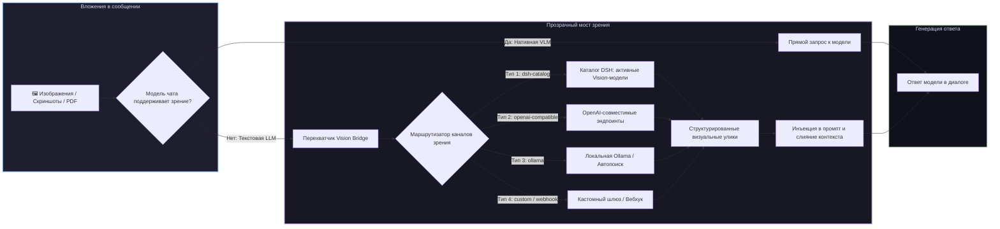

# 📦 @goodandready/dsh-vision-bridge

<div align="center">

<h3>Универсальный мост зрения, мультимодальный адаптер и набор из 27 инструментов компьютерного зрения для DeepSeek Harness</h3>

<p align="center">
  <a href="https://www.npmjs.com/package/@goodandready/dsh-vision-bridge"></a>
  <a href="LICENSE"></a>
  <a href="https://github.com/topics/dsh-plugin"></a>
  <a href="https://nodejs.org"></a>
</p>

<p align="center">
  <a href="README.md"><b>🇬🇧 English</b></a> •
  <a href="README.ru.md"><b>🇷🇺 Русский</b></a> •
  <a href="README.zh.md"><b>🇨🇳 中文说明</b></a>
</p>

</div>

---

## ⚡ Обзор

**`dsh-vision-bridge`** — мощнейший мультимодальный комбайн для **DeepSeek Harness**.

Плагин решает две ключевые задачи:
1. **Универсальный мост зрения**: когда пользователь отправляет изображения, схемы или PDF-документы в **чисто текстовые LLM**, плагин автоматически перехватывает вложения, запрашивает структурированное визуальное описание у настроенных каналов зрения и внедряет его в контекст промпта — полностью исключая ошибку `model does not support image input`.
2. **27 инструментов компьютерного зрения для агента**: даёт агентам богатый набор тулов (OCR, VQA, координатное заземление, парсинг UI-интерфейсов, извлечение страниц PDF, пиксельный diff и батч-обработка).



---

## 🌐 Архитектура динамических каналов зрения

Вместо привязки к конкретным моделям, `dsh-vision-bridge` динамически обнаруживает любые модели с поддержкой зрения в каталоге (`acceptsImages(model)`) и поддерживает **5 универсальных типов каналов**:

| Тип канала (`type`) | Назначение | Пример конфигурации |
|---|---|---|
| `dsh-catalog` | Любая Vision-модель, подключённая в провайдерах DSH | `{ type: 'dsh-catalog', provider: 'provider-id', model: 'model-id' }` |
| `openai-compatible` | Прямой OpenAI-совместимый эндпоинт (локальный движок, шлюз) | `{ type: 'openai-compatible', baseURL: 'http://localhost:8000/v1', model: '...' }` |
| `ollama` | Локальный инстанс Ollama с авто-обнаружением (`autoLocalOllama`) | `{ type: 'ollama', baseURL: 'http://localhost:11434/v1', model: '...' }` |
| `custom` | Пользовательский HTTP-запрос по шаблону `requestTemplate` | `{ type: 'custom', baseURL: '...', requestTemplate: {...} }` |
| `webhook` | Прямой вызов HTTP POST вебхука | `{ type: 'webhook', baseURL: 'https://...' }` |

> [!TIP]
> **Автоопределение локальной Ollama**: если каналы не настроены, а на `localhost:11434` запущена Ollama, плагин автоматически найдёт и подключит локальную Vision-модель при старте!

---

## 🛠️ Полная таблица 27 инструментов агента

`dsh-vision-bridge` регистрирует 27 специализированных инструментов в `ctx.tools`:

| Имя инструмента | Назначение | Ключевые параметры |
|---|---|---|
| `describe_image` | Общее смысловое описание и аннотирование изображения | `image_path`, `detail_level` |
| `read_image` | Прямое чтение текста с сохранением естественного порядка | `image_path`, `language` |
| `vision_ocr` | Высокоточное оптическое распознавание символов | `image_path`, `detect_orientation` |
| `vision_ocr_local` | 100% оффлайн локальный движок OCR | `image_path` |
| `vision_long_ocr` | Распознавание сложных многоколоночных документов | `image_path`, `preserve_layout` |
| `vision_pdf_pages` | Извлечение страниц PDF, постраничный рендеринг и OCR | `pdf_path`, `pages`, `dpi` |
| `vision_describe_structured` | Извлечение структурированного JSON (объекты, текст, цвета) | `image_path`, `schema` |
| `vision_vqa` | Визуальные ответы на вопросы по выделенным областям | `image_path`, `question`, `bbox` |
| `vision_ground` | Определение координат и bounding box объектов | `image_path`, `query` |
| `vision_crop` | Динамическая обрезка картинки по координатам или точкам | `image_path`, `bbox`, `target_path` |
| `vision_detect` | Детекция объектов, подсчёт и классификация | `image_path`, `categories` |
| `vision_compare` | Семантическое сравнение нескольких изображений | `image_paths`, `aspects` |
| `vision_pixel_diff` | Попиксельное сравнение визуальной регрессии | `image_a`, `image_b`, `threshold` |
| `vision_ui_layout` | Парсинг UI-разметки, иерархии кнопок и элементов | `image_path`, `framework` |
| `vision_translate_image` | Перевод текста прямо на изображении | `image_path`, `target_lang` |
| `vision_colors` | Анализ цветовой палитры и доминирующих контрастов | `image_path`, `palette_size` |
| `vision_extract_foreground` | Удаление фона и изоляция главного объекта | `image_path`, `output_path` |
| `vision_trace` | Трассировка линий, чертежей и векторных контуров | `image_path`, `smoothness` |
| `vision_html_screenshot` | Рендеринг фрагментов HTML/CSS в скриншот | `html_content`, `viewport` |
| `vision_video_describe` | Анализ ключевых кадров видео и таймлайн-сводка | `video_path`, `fps` |
| `vision_batch` | Параллельная батч-обработка группы картинок | `image_paths`, `task` |
| `vision_browser_snapshot` | Снимок экрана headless-браузера | `url`, `wait_selector` |
| `vision_browser_click` | Клик по визуальным координатам в браузере | `coordinate`, `element_text` |
| `vision_browser_navigate` | Визуальная навигация по веб-страницам | `url` |
| `vision_present` | Форматирование визуальных презентаций и подсветка | `image_path`, `highlights` |
| `vision_materialize` | Материализация и кэширование визуальных ассетов | `asset_ref` |
| `vision_page_persist` | Сохранение визуального контекста между сессиями | `session_id`, `state` |

---

## 📊 Производительность, кэширование и учёт затрат

* **Дисковый LRU-кэш улик**: одинаковые скриншоты мгновенно отдаются из кэша с **0 мс задержки и 0 затрат токенов**.
* **Мониторинг расходов**: статистика токенов и затрат доступна через `GET /dsh-vision-bridge/costs` и `GET /dsh-vision-bridge/stats`.
* **Встроенный бенчмарк**: тестирование задержек каналов через `GET /dsh-vision-bridge/bench`.

---

## 📦 Быстрая установка

```bash
dsh plugin --profile web add @goodandready/dsh-vision-bridge
```

---

## ⚙️ Пример конфигурации (`settings.yaml`)

```yaml
dsh-vision-bridge:
  enabled: true
  autoLocalOllama: true
  channels:
    - type: dsh-catalog
      provider: my-provider
      model: my-vision-model
    - type: openai-compatible
      baseURL: http://127.0.0.1:8000/v1
      model: my-model
      keyEnv: API_KEY_ENV
    - type: ollama
      baseURL: http://127.0.0.1:11434/v1
  channelFallback: sequential
  channelTimeoutMs: 30000
  cacheEnabled: true
  maxCacheMb: 250
  pdfDpi: 200
```

---

## 📄 Лицензия

MIT © [GooDAnDReaDY](https://github.com/GooDAnDReaDY)
