# 📦 @goodandready/dsh-vision-bridge

<div align="center">

<h3>Универсальный Vision-мост для DeepSeek Harness: работа с изображениями в чате с текстовыми моделями</h3>

<p align="center">
  <a href="https://www.npmjs.com/package/@goodandready/dsh-vision-bridge"></a>
  <a href="LICENSE">.svg?style=for-the-badge&color=10b981&labelColor=064e3b" alt="license"></a>
  <a href="https://github.com/topics/dsh-plugin"></a>
  <a href="https://nodejs.org"></a>
</p>

<!-- Обязательная кнопка перехода на витрину всех проектов -->
<p align="center">
  <a href="https://goodandready.app/"></a>
</p>

<p align="center">
  <a href="README.md"><b>🇬🇧 English</b></a> •
  <a href="README.ru.md"><b>🇷🇺 Русский</b></a> •
  <a href="README.zh.md"><b>🇨🇳 中文说明</b></a>
</p>

</div>

---

## ⚡ Обзор и решаемая проблема

При общении с чисто текстовыми LLM-моделями (например, `deepseek-v3`, Qwen без vision) в **DeepSeek Harness** пользователи сталкиваются с невозможностью прикрепления изображений:

1. В **DSH 0.1.2-alpha.2+** контроллер сессий на бэкенде выполняет строгую проверку модальностей (`ctx.llm.resolveModelInfo`). Если у модели диалога в `inputModalities` отсутствует `'image'`, сервер немедленно отклоняет запрос с ошибкой `session/attachment-invalid` («Model does not support image input»).
2. Текстовые адаптеры при получении сырых блоков изображений завершают диалог сбоем.

### Как `dsh-vision-bridge` решает проблему

`dsh-vision-bridge` выступает интеллектуальным прокси-мостом внутри среды Cordis:
* **Серверный мост модальностей (v0.5.3+)**: Оборачивает методы `ctx.llm.resolveModelInfo` и `ctx.llm.listModels`, благодаря чему ядро сессий DSH разрешает отправку картинок для любых моделей, когда включен vision-bridge.
* **Автоматическая подмена изображений (`agent/pre-step` и `llm/stream`)**: Перехватывает блоки картинок, запрашивает выбранную vision-модель (Gemini, Claude, Qwen-VL, локальную Ollama и др.), получает детальное текстовое описание и подставляет его в контекст вида `[Пользователь прикрепил изображение. Описание: ...]` для текстовой чат-модели.
* **Прямой пропуск (Native Passthrough)**: Автоматически распознает мультимодальные модели и передает изображения напрямую без повторного описания.
* **26 специализированных инструментов**: Предоставляет инструменты OCR, визуального поиска (grounding), анализа UI и сравнения изображений.

---

## 🏗️ Архитектура

```mermaid
graph LR
    User["Пользователь отправляет картинку в Web UI"] --> Gateway["DSH Session Controller"]
    Gateway --> BridgeCheck{"Серверный мост (v0.5.3)"}
    BridgeCheck -->|"inputModalities + image"| SessionAllowed["Запрос принят шлюзом"]
    SessionAllowed --> Hook["Хук agent/pre-step"]
    
    Hook --> CheckNative{"Модель чата поддерживает vision?"}
    CheckNative -->|"Да (Native Passthrough)"| NativeLLM["Передача сырого изображения в LLM"]
    CheckNative -->|"Нет (Текстовая модель)"| VisionRouter["Каналы Vision Bridge"]
    
    VisionRouter --> VisionModel["Vision-модель\n(DSH / OpenAI / Ollama / Webhook)"]
    VisionModel --> Description["Генерация описания и OCR"]
    Description --> Rewrite["Замена картинки на текстовый маркер"]
    Rewrite --> ChatModel["Передача обогащенного текста в модель чата"]
    ChatModel --> Answer["Ответ ассистента в веб-чате"]
```



---

## ✨ Основные возможности

### 1. Режимы работы
* **`hybrid` (по умолчанию)**: Автоматическое описание прикрепленных изображений в чате + доступность всех 26 инструментов для явных вызовов агентом.
* **`llm`**: Только авто-подмена изображений в контексте сообщений; инструменты также доступны для вызова.
* **`tools`**: Авто-подмена выключена — модель чата должна самостоятельно вызывать `describe_image` или OCR инструменты.

### 2. Многоканальная маршрутизация (Multi-Channel Fallback)
Цепочки из нескольких vision-провайдеров с автоматическим переключением при сбоях (fallback) и защитой от перегрузок (circuit breaker):
* `dsh-catalog`: Автопоиск или явный выбор vision-модели из каталога DSH.
* `openai-compatible`: Любые OpenAI-совместимые API с поддержкой vision (vLLM, SGLang, OpenRouter).
* `ollama`: Автообнаружение локальных моделей Ollama (например, `minicpm-v`, `llama3.2-vision`).
* `webhook` / `custom`: Внешние HTTP/JSON-RPC сервисы.

### 3. Кэширование описаний (LRU Cache)
Кэширование ответов по хэшу `hash(байты + промпт + модель + режим)` экономит токены и ускоряет повторные запросы по одному и тому же изображению.

### 4. Набор инструментов (26 инструментов)

| Категория | Инструменты | Назначение |
|---|---|---|
| **Базовые** | `describe_image`, `read_image`, `inspect_image` | Анализ изображений по ID вложения, локальному пути или URL. |
| **Геометрия и поиск** | `vision_ground`, `vision_crop`, `vision_detect`, `vision_compare`, `vision_present` | Координаты bounding box (шкала 0–1000), детекция объектов, мульти-сравнение. |
| **OCR и текст** | `vision_ocr`, `vision_ocr_local`, `vision_long_ocr`, `vision_trace`, `vision_colors`, `vision_extract_foreground` | Распознавание текста, локальный оффлайн Tesseract OCR, склейка длинных скриншотов, векторизация SVG. |
| **Структурированный анализ** | `vision_describe_structured`, `vision_vqa`, `vision_ui_layout`, `vision_translate_image` | Выдача JSON (`{summary, ocr, layout, entities}`), ответы на короткие вопросы, разбор верстки UI. |
| **Пиксельные операции** | `vision_pixel_diff`, `vision_tile`, `vision_deskew`, `vision_enhance` | Попиксельное сравнение, нарезка тайлов, выравнивание и улучшение четкости. |

---

## 📦 Установка

```bash
dsh plugin --profile web add @goodandready/dsh-vision-bridge
```

После установки перезапустите Web UI. Карточка настроек доступна в разделе **Настройки → Плагины → vision-bridge**.

---

## ⚙️ Конфигурация (`settings.yaml`)

```yaml
dsh-vision-bridge:
  # Режим работы: 'hybrid' | 'llm' | 'tools'
  mode: hybrid
  
  # Провайдер и модель (пусто = автовыбор из каталога DSH)
  visionProvider: ""
  visionModel: ""
  
  # Пропуск картинок для нативных vision-моделей ('prefer' | 'never' | 'always')
  nativePassthrough: prefer
  
  # LRU-кэширование описаний
  cacheEnabled: true
  cacheMaxEntries: 200
  
  # Таймаут запроса в миллисекундах
  timeoutMs: 120000
  
  # Список дополнительных каналов
  channels: []
  channelStrategy: fallback # 'fallback' | 'race'
```

---

## 📄 Лицензия

MIT © [GooDAnDReaDY](https://github.com/GooDAnDReaDY)