# 📦 @goodandready/dsh-vision-bridge

<div align="center">

<h3>Универсальный Vision-мост для DeepSeek Harness: работа с изображениями в чате с текстовыми моделями</h3>

<p align="center">
  <a href="https://www.npmjs.com/package/@goodandready/dsh-vision-bridge"></a>
  <a href="LICENSE"></a>
  <a href="https://github.com/topics/dsh-plugin"></a>
  <a href="https://nodejs.org"></a>
</p>

<!-- Обязательная кнопка перехода на витрину всех проектов -->
<p align="center">
  <a href="https://goodandready.app/"></a>
</p>

<p align="center">
  <a href="README.md"><b>🇬🇧 English</b></a> •
  <a href="README.ru.md"><b>🇷🇺 Русский</b></a> •
  <a href="README.zh.md"><b>🇨🇳 中文说明</b></a>
</p>

</div>

---

## ⚡ Обзор и решаемая проблема

При общении с чисто текстовыми чат-моделями (любой provider/model, принимающий только текст) в **DeepSeek Harness** пользователи сталкиваются с невозможностью прикрепления изображений:

1. В **DSH 0.1.2-alpha.2+** контроллер сессий на бэкенде выполняет строгую проверку модальностей (`ctx.llm.resolveModelInfo`). Если у модели диалога в `inputModalities` отсутствует `'image'`, сервер немедленно отклоняет запрос с ошибкой `session/attachment-invalid` («Model does not support image input»).
2. Текстовые адаптеры при получении сырых блоков изображений завершают диалог сбоем.

### Как `dsh-vision-bridge` решает проблему

`dsh-vision-bridge` выступает интеллектуальным прокси-мостом внутри среды Cordis:
* **Серверный мост модальностей (v0.5.3+)**: Оборачивает методы `ctx.llm.resolveModelInfo` и `ctx.llm.listModels`, благодаря чему ядро сессий DSH разрешает отправку картинок для любых моделей, когда включен vision-bridge.
* **Автоматическая подмена изображений (`agent/pre-step` и `llm/stream`)**: Перехватывает блоки картинок, запрашивает выбранную vision-модель (provider/model из каталога или локальный OpenAI-совместимый endpoint), получает детальное текстовое описание и подставляет его в контекст вида `[Пользователь прикрепил изображение. Описание: ...]` для текстовой чат-модели.
* **Прямой пропуск (Native Passthrough)**: Автоматически распознает мультимодальные модели и передает изображения напрямую без повторного описания.
* **~40 специализированных инструментов**: Предоставляет инструменты OCR, визуального поиска (grounding), анализа UI, извлечения таблиц/формул, QR-кодов, UI-flow и консенсуса.

---

## 🏗️ Архитектура

```mermaid
graph LR
    User["Пользователь отправляет картинку в Web UI"] --> Gateway["DSH Session Controller"]
    Gateway --> BridgeCheck{"Серверный мост (v0.5.3)"}
    BridgeCheck -->|"inputModalities + image"| SessionAllowed["Запрос принят шлюзом"]
    SessionAllowed --> Hook["Хук agent/pre-step"]
    
    Hook --> CheckNative{"Модель чата поддерживает vision?"}
    CheckNative -->|"Да (Native Passthrough)"| NativeLLM["Передача сырого изображения в LLM"]
    CheckNative -->|"Нет (Текстовая модель)"| VisionRouter["Каналы Vision Bridge"]
    
    VisionRouter --> VisionModel["Vision-модель\n(DSH / OpenAI / Ollama / Webhook)"]
    VisionModel --> Description["Генерация описания и OCR"]
    Description --> Rewrite["Замена картинки на текстовый маркер"]
    Rewrite --> ChatModel["Передача обогащенного текста в модель чата"]
    ChatModel --> Answer["Ответ ассистента в веб-чате"]
```



---

## ✨ Основные возможности

### 1. Режимы работы
* **`hybrid` (по умолчанию)**: Автоматическое описание прикрепленных изображений в чате + доступность ~40 инструментов для явных вызовов агентом.
* **`llm`**: Только авто-подмена изображений в контексте сообщений; инструменты также доступны для вызова.
* **`tools`**: Авто-подмена выключена — модель чата должна самостоятельно вызывать `describe_image` или OCR инструменты.

### 2. Многоканальная маршрутизация (Multi-Channel Fallback)
Цепочки из нескольких vision-провайдеров с автоматическим переключением при сбоях (fallback) и защитой от перегрузок (circuit breaker):
* `dsh-catalog`: Автопоиск или явный выбор vision-модели из каталога DSH.
* `openai-compatible`: Любые OpenAI-совместимые API с поддержкой vision (vLLM, SGLang, OpenRouter).
* `ollama`: Автообнаружение и локальный инференс через любую vision-модель, доступную в локальном Ollama.
* `webhook` / `custom`: Внешние HTTP/JSON-RPC сервисы.

### 3. Кэширование описаний (LRU Cache)
Кэширование ответов по хэшу `hash(байты + промпт + модель + режим)` экономит токены и ускоряет повторные запросы по одному и тому же изображению.

### 4. Набор инструментов (~40 инструментов)

| Категория | Инструменты | Назначение |
|---|---|---|
| **Базовые** | `describe_image`, `read_image`, `inspect_image` | Анализ изображений по ID вложения, локальному пути или URL. |
| **Геометрия и поиск** | `vision_ground`, `vision_crop`, `vision_detect`, `vision_compare`, `vision_present` | Координаты bounding box (шкала 0–1000), детекция объектов, мульти-сравнение. |
| **OCR и текст** | `vision_ocr`, `vision_ocr_local`, `vision_long_ocr`, `vision_trace`, `vision_colors`, `vision_extract_foreground` | Распознавание текста, локальный оффлайн Tesseract OCR, склейка длинных скриншотов, векторизация SVG. |
| **Структурированный анализ** | `vision_describe_structured`, `vision_vqa`, `vision_ui_layout`, `vision_translate_image` | Выдача JSON (`{summary, ocr, layout, entities}`), ответы на короткие вопросы, разбор верстки UI. |
| **Пиксельные операции** | `vision_pixel_diff`, `vision_quality_check` | Семантическое сравнение, оценка качества (резкость/освещённость). |
| **Документы и Intelligence** | `vision_extract_formula`, `vision_extract_table`, `vision_scan_barcode`, `vision_extract_structured`, `vision_audit_accessibility` | Извлечение формул в LaTeX, таблиц в Markdown/HTML, сканирование QR/штрихкодов, JSON Schema экстрактор, аудит доступности WCAG. |
| **Сценарии, Консенсус и Память** | `vision_ui_flow`, `vision_consensus`, `vision_memory_search` | Реконструкция графа пользовательских сценариев (User Journey / Mermaid), мультимодельный консенсус (устранение галлюцинаций), семантический поиск по памяти изображений. |
| **Вложения (v0.5.33)** | `vision_attach_pages`, `vision_attach_frames`, `vision_attach_images` | Публикуют страницы PDF, кадры видео и локальные/удалённые изображения как вложения в диалог — чтобы чат-модель с нативным зрением смотрела пиксели сама. |

---

## 📦 Установка

```bash
dsh plugin --profile web add @goodandready/dsh-vision-bridge
```

После установки перезапустите Web UI. Карточка настроек доступна в разделе **Настройки → Плагины → vision-bridge**.

---

## ⚙️ Конфигурация (`settings.yaml`)

```yaml
dsh-vision-bridge:
  # Режим работы: 'hybrid' | 'llm' | 'tools'
  mode: hybrid
  
  # Провайдер и модель (пусто = автовыбор из каталога DSH)
  visionProvider: ""
  visionModel: ""
  
  # Пропуск картинок для нативных vision-моделей ('prefer' | 'never' | 'always')
  nativePassthrough: prefer
  hideRedundantTools: true   # скрывать компенсационные инструменты, если модель и так видит изображения
  attachMaxItems: 8          # сколько страниц/кадров/файлов публикует один attach-вызов
  
  # LRU-кэширование описаний
  cacheEnabled: true
  cacheMaxEntries: 200
  
  # Таймаут запроса в миллисекундах
  timeoutMs: 120000
  
  # Список дополнительных каналов
  channels: []
  channelFallback: sequential # 'sequential' | 'parallel-race'
```

### Параметры конфигурации

| Параметр | Тип | По умолчанию | Описание |
|---|---|---|---|
| `mode` | `string` | `"hybrid"` | Режим обработки (`hybrid`, `llm`, `tools`). |
| `visionProvider` | `string` | `""` | ID vision-провайдера (пусто = авто-выбор). |
| `visionModel` | `string` | `""` | ID vision-модели (пусто = авто-выбор). |
| `nativePassthrough` | `string` | `"prefer"` | Поведение для моделей с нативным зрением (`prefer`, `never`, `always`). |
| `hideRedundantTools` | `boolean` | `true` | Скрывать компенсационные инструменты у агента, чья модель и так принимает изображения; остаются только дополнительные инструменты. |
| `attachMaxItems` | `number` | `8` | Сколько изображений публикует один вызов `vision_attach_*` (страницы PDF, кадры видео, файлы). Жёсткий потолок 32. |
| `cacheEnabled` | `boolean` | `true` | Включает LRU-кэш описаний. |
| `cacheMaxEntries` | `number` | `200` | Предел числа записей в памяти. |
| `timeoutMs` | `number` | `120000` | Таймаут выполнения в миллисекундах. |
| `channelFallback` | `string` | `"sequential"` | Маршрутизация каналов (`sequential`, `parallel-race`); порядок — через `channelOrderMode`. |

---

## 📝 Изменения в v0.5.30

Релиз безопасности и честности. Кратко для пользователей:

* **SSRF-политика**: URL-источники, предложенные моделью (`describe_image` urls, `inspect_image`, headless-chrome инструменты), скачиваются только через слой политики — не-http(s) схемы, localhost-имена и приватные/loopback/link-local хосты (включая IPv4-mapped IPv6 и NAT64) отклоняются на каждом редиректе; тела ограничены. Новая настройка `allowedUrlHosts` (точный hostname-allowlist) намеренно возвращает доступ к внутреннему эндпоинту.
* **`apiKeyRef`**: каналы могут ссылаться на credential-сервис или переменную окружения ПО ИМЕНИ — открытый `apiKey` в `settings.yaml` больше не требуется. Существующие inline-ключи продолжают работать; сохранение маскированных ключей матчингом по идентификатору канала, а не по позиции.
* **Гарды роутов**: `POST /bench`, `POST /batch`, `DELETE /batch/:id`, `DELETE /journal`, `DELETE /cache` требуют same-origin, как остальные мутирующие маршруты. `GET /doctor` по умолчанию статический; пробы каналов — только с `?probe=1` (нужен same-origin).
* **Честность настроек**: `maskPII`, `stripEXIF`, `auditLog`, `consensusEnabled` работают end-to-end. Декоративные переключатели `blurFaces`, `nsfwFilter`, `tileLargeImages`/`tileThreshold` и пустые пресеты Local/Cloud/LM Studio удалены. Changed in v0.5.30: если вы на них рассчитывали — эффекта у них никогда не было.
* **Английский — исходный язык**: все пользовательские строки на английском; зашитый русский словарь удалён — русский во время работы даёт translation-плагин.
* **Разделение ядра**: чистое ядро (схема конфига + хелперы) переехало в `lib/vision-core.js`; `lib/index.js` ре-экспортирует его — без изменения API. Исправлена регрессия v0.5.13 с пустым ответом `describe_image`; снова работает `vision_annotate`; pHash-кэш больше не путает похожие изображения.
---

## 📝 Изменения в v0.5.31

Технический релиз — без изменений пользовательского поведения.

* **Внутренняя структура**: регистрации инструментов перенесены в доменные модули `lib/tools/*` (core / grounding / ocr / document / analysis / media); `lib/index.js` ре-экспортирует всё как раньше. Файлы меньше, зависимости хоста и доменов явные.
* **Укрепление карточки настроек**: отказоустойчивая регистрация локали, убран избыточный sidebar-fallback, доступ к сервисам плагина через безопасную обёртку `ctx.get`, `/config` принимает расширенный набор полей (`cacheMaxEntries`, `channelFallback`).

---

## 📝 Изменения в v0.5.32

Релиз стабильности и архитектуры.

* **Внутренняя структура**: регистрации ~44 инструментов перенесены в доменные модули `lib/tools/*` (core / grounding / ocr / document / analysis / media) с явными зависимостями; `lib/index.js` остаётся точкой входа хоста.
* **Фиксы стабильности**: завершённые батчи освобождаются через 10 минут (устранён рост памяти); `/upload-pdf` отклоняет payload выше новой настройки `maxPdfBytes` (20 МиБ по умолчанию) вместо буферизации произвольных тел; `vision_memory_search` ищет по собственному описанию каждого аттачмента (раньше все совпадали одинаково); мёртвый код хоста удалён; метки журнала согласованы между путями.
* **Настройки**: новая `maxPdfBytes` (жёсткий лимит загрузки PDF).


## 📝 Изменения в v0.5.33

Релиз в сторону нативного зрения: мост теперь работает не только с текстовыми моделями, но и с теми, кто видит изображения сам.

* **Attach-домен (`vision_attach_pages`, `vision_attach_frames`, `vision_attach_images`)**: страницы PDF, выбранные кадры видео и изображения из файлов, каталогов и по URL публикуются **вложениями в диалог**, поэтому модель с нативным зрением смотрит пиксели сама, а не платит за второй vision-вызов. Каждое изображение сжимается по настройкам `imageMaxWidth`/`imageMaxHeight`/`imageQuality` и ограничено `maxImageBytes`; для URL действует та же SSRF-политика, для локальных путей — `allowedImageDirs`.
* **Выдача инструментов по модели**: на маршруте, где чат-модель и так принимает изображения, компенсационные инструменты моста скрываются от агента (они ему не нужны) и остаются только дополнительные; на текстовом маршруте вместо них скрываются attach-инструменты, потому что такая модель вложения не увидит. Поведением управляет новая настройка `hideRedundantTools` (включена по умолчанию).
* **Новые настройки в карточке**: группа **Attachments** показывает `attachMaxItems` (целое 1–32, по умолчанию 8 — сколько изображений публикует один вызов) и `hideRedundantTools`. Оба поля проверяются при сохранении, значение вне диапазона отклоняется с понятным сообщением. Размеры изображений теперь записываются и в живой снимок настроек, а не только в роут.
* **Batch API**: `DELETE /batch/:id` освобождает завершённый batch сразу, под той же same-origin защитой, что start/cancel. Таймер TTL записи batch больше не удерживает короткоживущий процесс — набор тестов сократился с 10 минут до ~3,5 секунд.
* **Режим tools**: изображения, прикреплённые в чате, теперь индексируются до гейта санитайзинга, поэтому инструменты по ID вложения (и алиас `read_image`) работают и в режиме `tools`; раньше идентификаторы там были недоступны.
* **Исправления**: один нечитаемый источник больше не обрывает `vision_attach_images` — он попадает в `Skipped N: <имя>: <причина>`, а читаемые источники прикрепляются; отказ fetch-политики остаётся жёсткой ошибкой. Текстовый слой PDF теперь действительно появляется (`pdftotext` не определялся, и слой молча не отдавался). Обрезка диапазона страниц или числа кадров лимитом отражается в `truncated` и в примечании.
* **Внутреннее**: CI ставит poppler без `sudo`, идёт один прогон на коммит, сериализация по ref и установка ffmpeg для кадровых тестов; в репозитории появился шаблон PR и игнор `.worktrees/`.

---

## 📄 Лицензия

MIT © [GooDAnDReaDY](https://github.com/GooDAnDReaDY)

### 15. 🛡️ Безопасность и интеграция с ядром (`v0.5.27`)
* **Маскирование секретов**: Эндпоинт `GET /channels` маскирует API-ключи провайдеров (`sk-p...7890` или `********`) и отдаёт флаг `hasApiKey: true`. При отправке маски обратно через `POST /channels` оригинальный ключ сохраняется без перезаписи.
* **Гард от CSRF и межсайтовых атак**: Все мутирующие и платные маршруты (`/config`, `/channels`, `/upload-pdf`, `/test`, `/bench`, `/batch`, `DELETE /journal`, `DELETE /cache`, `/doctor?probe=1`) проверяют заголовок `sec-fetch-site` через `isTrustedSettingsRequest` и блокируют cross-site вызовы ответом `403 Forbidden: same-origin only`. Отчёт `GET /doctor` по умолчанию статический (без проб каналов).
* **SSRF-политика**: URL-источники, предложенные моделью, скачиваются только через `safeFetch` — не-http(s) схемы, localhost-имена и приватные/loopback/link-local хосты (включая IPv4-mapped IPv6 и NAT64) отклоняются на каждом редиректе; тела ограничены. `allowedUrlHosts` — явный allowlist внутреннего эндпоинта.
* **apiKeyRef**: канал может ссылаться на credential/env-переменную ПО ИМЕНИ вместо открытого `apiKey` в настройках; значение резолвится в момент вызова. `GET /channels` по-прежнему маскирует значения; сохранение маскированных ключей матчингом по идентификатору канала.
* **Приватность и честность**: настройки `maskPII`, `stripEXIF`, `auditLog`, `consensusEnabled` работают end-to-end; декоративные переключатели блюра лиц / NSFW / тайлинга и пустые пресеты удалены.
* **Реактивная привязка к settingsScope**: Карточка настроек в браузере связывается со стандартным сервисом ядра `ctx.settingsScope.bind({ namespace: 'dsh-vision-bridge' })` со слушателями снапшотов.
