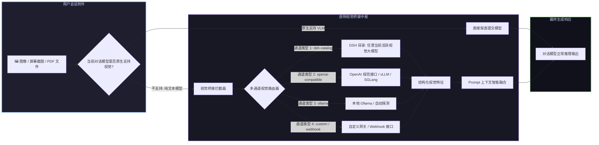

# 📦 @goodandready/dsh-vision-bridge

<div align="center">

<h3>DeepSeek Harness 通用视觉桥接、多模态转接器与 27 合 1 计算机视觉工具箱</h3>

<p align="center">
  <a href="https://www.npmjs.com/package/@goodandready/dsh-vision-bridge"></a>
  <a href="LICENSE"></a>
  <a href="https://github.com/topics/dsh-plugin"></a>
  <a href="https://nodejs.org"></a>
</p>

<p align="center">
  <a href="README.md"><b>🇬🇧 English</b></a> •
  <a href="README.ru.md"><b>🇷🇺 Русский</b></a> •
  <a href="README.zh.md"><b>🇨🇳 中文说明</b></a>
</p>

</div>

---

## ⚡ 插件概览

**`dsh-vision-bridge`** 是为 **DeepSeek Harness** 量身定制的全能多模态视觉处理中枢。

它彻底解决了两大核心场景痛点：
1. **通用多模态视觉桥接**：当用户向**纯文本大模型**（如 `deepseek-v4-flash`、`deepseek-chat`）发送图片、截图或 PDF 时，插件在请求发出前自动拦截附件，调度独立配置的多通道路由提取高保真结构化图文描述并无缝融合至 Prompt 中，彻底杜绝 `does not support image input` 报错。
2. **27 项专属视觉工具矩阵**：为智能体赋予全套视觉感知工具（OCR、VQA、空间坐标定位、UI 原型分析、PDF 多页解析、图片对比及批量处理）。



---

## 🌐 动态视觉通道架构 (5 大通道类型)

`dsh-vision-bridge` 不绑定任何静态模型名称，而是从 DSH 模型目录中动态发现所有视觉模型 (`acceptsImages(model)`)，并支持 5 种通道类型：

| 通道类型 (`type`) | 功能说明 | 配置示例 |
|---|---|---|
| `dsh-catalog` | DSH 已配置的任意上游视觉模型 | `{ type: 'dsh-catalog', provider: 'my-provider', model: 'my-vlm' }` |
| `openai-compatible` | 标准 OpenAI 格式视觉接口 (vLLM, SGLang, LiteLLM, OpenRouter) | `{ type: 'openai-compatible', baseURL: 'http://localhost:8000/v1', model: '...' }` |
| `ollama` | 本地 Ollama 实例并支持自动探针 (`autoLocalOllama`) | `{ type: 'ollama', baseURL: 'http://localhost:11434/v1', model: '...' }` |
| `custom` | 基于 `requestTemplate` 与 `responsePath` 的自定义 HTTP 协议 | `{ type: 'custom', baseURL: '...', requestTemplate: {...} }` |
| `webhook` | 专用 HTTP POST Webhook | `{ type: 'webhook', baseURL: 'https://...' }` |

---

## 📦 安装指南

```bash
dsh plugin --profile web add @goodandready/dsh-vision-bridge
```

---

## 📄 开源协议

MIT © [GooDAnDReaDY](https://github.com/GooDAnDReaDY)
