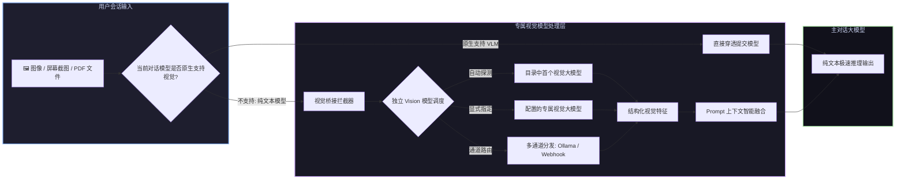

# 📦 @goodandready/dsh-vision-bridge

<div align="center">

<h3>DeepSeek Harness 通用视觉桥接、多模态转接器与 27 合 1 计算机视觉工具箱</h3>

<p align="center">
  <a href="https://www.npmjs.com/package/@goodandready/dsh-vision-bridge"></a>
  <a href="LICENSE"></a>
  <a href="https://github.com/topics/dsh-plugin"></a>
  <a href="https://nodejs.org"></a>
</p>

<p align="center">
  <a href="README.md"><b>🇬🇧 English</b></a> •
  <a href="README.ru.md"><b>🇷🇺 Русский</b></a> •
  <a href="README.zh.md"><b>🇨🇳 中文说明</b></a>
</p>

</div>

---

## ⚡ 插件概览

**`dsh-vision-bridge`** 是为 **DeepSeek Harness** 量身定制的全能多模态视觉处理中枢。

它彻底解决了三大核心场景痛点：
1. **通用多模态视觉桥接**：当用户向**纯文本大模型**发送图片、截图或 PDF 时，插件在请求发出前自动拦截附件，调度独立配置的多通道路由提取高保真结构化图文描述并无缝融合至 Prompt 中，彻底杜绝 `model does not support image input` 报错。
2. **独立视觉大模型解耦指定**：支持为视觉任务指定**专属的独立 Vision 视觉大模型**，使主对话模型无需承担多模态解析开销，专注纯文本极速推理。
3. **27 项专属视觉工具矩阵**：为智能体赋予全套视觉感知工具（OCR、VQA、空间坐标定位、UI 原型分析、PDF 多页解析、图片对比及批量处理）。



---

## 🎯 独立 Vision 模型指定与网桥运行模式

您可以将**对话推理模型**与**视觉理解模型**完全解耦：

### 1. 专属视觉模型指定 (`visionProvider` 与 `visionModel`)
* **自动探测 (默认)**：留空 (`""`) 时，系统自动在已加载的服务商目录中选用首个 `acceptsImages` 为 true 的模型。
* **显式指定专属模型**：在 **设置 → Vision Bridge** 中明确指定 `visionProvider` 与 `visionModel`。所有后台图像描述及视觉工具调用将统一路由至此模型，完全不改变聊天主模型的配置。

### 2. 网桥工作模式 (`mode`)
* `hybrid` (默认)：自动为纯文本模型补齐图片描述 **且** 同时向智能体开放全部 27 项视觉工具。
* `llm`：仅开启后台自动图片转文本注入（不向智能体暴露工具）。
* `tools`：不执行后台自动转写；智能体在感知到图片引用后，根据需要显式调用视觉工具 (`describe_image`, `vision_ocr` 等)。

---

## 📦 安装指南

```bash
dsh plugin --profile web add @goodandready/dsh-vision-bridge
```

---

## 📄 开源协议

MIT © [GooDAnDReaDY](https://github.com/GooDAnDReaDY)
