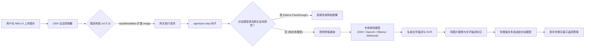

# 📦 @goodandready/dsh-vision-bridge

<div align="center">

<h3>DeepSeek Harness 通用视觉桥接插件：为纯文本模型提供无缝多模态图像支持</h3>

<p align="center">
  <a href="https://www.npmjs.com/package/@goodandready/dsh-vision-bridge"></a>
  <a href="LICENSE"></a>
  <a href="https://github.com/topics/dsh-plugin"></a>
  <a href="https://nodejs.org"></a>
</p>

<!-- Showcase Button -->
<p align="center">
  <a href="https://goodandready.app/"></a>
</p>

<p align="center">
  <a href="README.md"><b>🇬🇧 English</b></a> •
  <a href="README.ru.md"><b>🇷🇺 Русский</b></a> •
  <a href="README.zh.md"><b>🇨🇳 中文说明</b></a>
</p>

</div>

---

## ⚡ 概述与核心解决问题

在 **DeepSeek Harness** 中与纯文本聊天模型（任何仅接受文本的 provider/model）对话时，用户无法直接在聊天窗口附加和发送图片：

1. 在 **DSH 0.1.2-alpha.2+** 中，后端会话控制器进行严格的模态校验 (`ctx.llm.resolveModelInfo`)。如果当前对话模型的 `inputModalities` 中不包含 `'image'`，请求会被直接拒绝并报错 `session/attachment-invalid` ("Model does not support image input")。
2. 纯文本适配器如果直接接收到多模态图像块，会抛出请求错误。

### `dsh-vision-bridge` 解决方案

`dsh-vision-bridge` 在 Cordis 运行时内建立透明代理：
* **服务端模态桥接 (v0.5.3+)**：自动包装 `ctx.llm.resolveModelInfo` 和 `ctx.llm.listModels`，使会话网关允许所有模型接收图像附件。
* **自动图像改写 (`agent/pre-step` 与 `llm/stream`)**：自动拦截图片，调用所配置的视觉模型（目录中的 provider/model，或本地 OpenAI 兼容端点）生成描述，并将图片替换为文本提示 `[用户上传了图片。内容描述：...]` 传递给纯文本模型。
* **原生直通 (Native Passthrough)**：自动识别原生支持视觉的模型并直接传递图像，无需重复转换。
* **约 40 个专用视觉工具**：提供 OCR、目标定位 (grounding)、UI 结构解析、表格/公式提取、二维码识别、UI 流程重建与多模型共识等完整工具套件。

---

## 🏗️ 架构图



---

## ✨ 核心特性

### 1. 运行模式
* **`hybrid` (默认)**：对话中自动改写图片为文本描述，同时保留约 40 个工具供模型显式调用。
* **`llm`**：纯自动改写模式；工具依然可供调用。
* **`tools`**：禁用自动改写，必须由模型显式调用 `describe_image` 等工具。

### 2. 多通道故障转移 (Multi-Channel Fallback)
支持多视觉后端级联、故障熔断与并发竞速：
* `dsh-catalog`：自动或手动选择 DSH 中已注册的视觉模型。
* `openai-compatible`：支持 vLLM、SGLang、OpenRouter 等 OpenAI 兼容视觉接口。
* `ollama`：自动发现并调用本地 Ollama 实例提供的任意视觉模型。
* `webhook` / `custom`：外部 HTTP / JSON-RPC 服务。

### 3. LRU 响应缓存
基于 `hash(bytes + prompt + model + mode)` 的内存缓存，避免重复分析相同图片，节省 Token 开销。

---

### 4. 完整工具清单（约 40 个工具）

| 工具类别 | 工具 | 说明 |
|---|---|---|
| **核心** | `describe_image`, `read_image`, `inspect_image` | 通过附件 ID、文件路径或 URL 进行通用图像分析。 |
| **几何与检测** | `vision_ground`, `vision_crop`, `vision_detect`, `vision_compare`, `vision_present` | 边界框坐标（0–1000 刻度）、目标清单、多图对比。 |
| **OCR 与文本** | `vision_ocr`, `vision_ocr_local`, `vision_long_ocr`, `vision_trace`, `vision_colors`, `vision_extract_foreground` | 文字识别、本地 Tesseract OCR（离线）、长截图拼接、SVG 描摹、调色板。 |
| **结构化与界面** | `vision_describe_structured`, `vision_vqa`, `vision_ui_layout`, `vision_translate_image` | JSON 结构输出（`{summary, ocr, layout, entities}`）、简短 VQA、界面区块分析。 |
| **像素与诊断** | `vision_pixel_diff`, `vision_quality_check` | 语义化视觉差异、质量评分（模糊/曝光）。 |
| **附件（v0.5.33）** | `vision_attach_pages`, `vision_attach_frames`, `vision_attach_images` | 将 PDF 页面、视频帧、本地/远程图片作为会话附件发布，供原生视觉模型直接查看。 |

---

## 📦 安装方法

```bash
dsh plugin --profile web add @goodandready/dsh-vision-bridge
```

安装完成后重启 DSH Web UI。配置卡片位于 **设置 → 插件 → vision-bridge**。

---

## ⚙️ 配置示例 (`settings.yaml`)

```yaml
dsh-vision-bridge:
  mode: hybrid
  visionProvider: ""
  visionModel: ""
  nativePassthrough: prefer
  cacheEnabled: true
  cacheMaxEntries: 200
  timeoutMs: 120000
  channels: []
  channelFallback: sequential
  hideRedundantTools: true   # 当聊天模型本身已能看图时隐藏桥接工具
  attachMaxItems: 8          # 单次 attach 调用可发布的页面/帧/文件数
```

---

---

### 参数说明

| 参数 | 类型 | 默认值 | 说明 |
|---|---|---|---|
| `mode` | `string` | `"hybrid"` | 处理模式（`hybrid`、`llm`、`tools`）。 |
| `visionProvider` | `string` | `""` | 视觉服务的 provider ID（留空 = 自动选择）。 |
| `visionModel` | `string` | `""` | 视觉模型 ID（留空 = 自动选择）。 |
| `nativePassthrough` | `string` | `"prefer"` | 原生视觉模型的处理方式（`prefer`、`never`、`always`）。 |
| `hideRedundantTools` | `boolean` | `true` | 当聊天模型原生支持图片时，对该 agent 隐藏补偿类工具，仅保留扩展工具。 |
| `attachMaxItems` | `number` | `8` | 单次 `vision_attach_*` 调用最多发布的图片数（PDF 页面、视频帧、文件）。硬上限 32。 |
| `cacheEnabled` | `boolean` | `true` | 是否启用描述结果的 LRU 缓存。 |
| `cacheMaxEntries` | `number` | `200` | 内存中缓存的条目上限。 |
| `timeoutMs` | `number` | `120000` | 执行超时（毫秒）。 |
| `channelFallback` | `string` | `"sequential"` | 通道调度方式（`sequential`、`parallel-race`）；顺序由 `channelOrderMode` 决定。 |

---

## 📝 v0.5.30 中的变更

安全与诚实性发布。面向用户的简要总结：

* **SSRF 抓取策略**：模型提供的图片 URL（`describe_image` 的 urls、`inspect_image` 以及 headless-chrome 工具）只能通过策略层抓取——非 http(s) 协议、localhost 名称以及私有/回环/链路本地主机（包括 IPv4 映射 IPv6 和 NAT64）在每一次重定向跳转中都会被拒绝；响应体有大小上限。新设置 `allowedUrlHosts`（精确主机名白名单）可显式放行内部端点。
* **`apiKeyRef`**：通道可以按名称引用凭据服务条目或环境变量——`settings.yaml` 中不再需要明文 `apiKey`。现有的内联 `apiKey` 继续有效；保存时掩码密钥的保留按通道标识匹配，而非数组位置。
* **路由防护**：`POST /bench`、`POST /batch`、`DELETE /batch/:id`、`DELETE /journal`、`DELETE /cache` 与其他变更类路由一样要求同源。`GET /doctor` 默认为静态；仅 `?probe=1` 时进行通道探测（需要同源）。
* **设置诚实性**：`maskPII`、`stripEXIF`、`auditLog`、`consensusEnabled` 已端到端生效。此前仅具装饰性的 `blurFaces`、`nsfwFilter`、`tileLargeImages`/`tileThreshold` 开关和无效的 Local/Cloud/LM Studio 预设已被移除。Changed in v0.5.30：如果您曾依赖它们，请注意它们从未产生过效果。
* **英语为源语言**：所有用户可见字符串均为英语；捆绑的俄语字典已移除——运行时的俄语由翻译插件提供。
* **核心拆分**：纯内核（配置模式 + 辅助函数）移至 `lib/vision-core.js`；`lib/index.js` 对其进行重新导出——API 无变化。修复了 v0.5.13 中 `describe_image` 返回空描述的回归；`vision_annotate` 恢复工作；pHash 缓存不再混淆相似图片。
---

## 📝 v0.5.31 中的变更

维护版本——用户行为无变化。

* **内部结构**：工具注册已迁移到 `lib/tools/*` 领域模块（core / grounding / ocr / document / analysis / media）；`lib/index.js` 像以前一样重新导出所有内容。文件更小，宿主与工具领域之间的依赖显式化。
* **设置卡片加固**：容错的 locale 注册、移除冗余的侧边栏回退、通过安全的 `ctx.get` 包装访问插件服务、`/config` 接受扩展字段集（`cacheMaxEntries`、`channelFallback`）。

---

## 📝 v0.5.32 中的变更

稳定性与架构版本。

* **内部结构**：全部约 44 个工具注册迁移到 `lib/tools/*` 领域模块（core / grounding / ocr / document / analysis / media），依赖显式传递；`lib/index.js` 仍为主机入口。
* **稳定性修复**：完成的批处理记录在 10 分钟轮询窗口后释放（修复内存增长）；`/upload-pdf` 拒绝超过新设置 `maxPdfBytes`（默认 20 MiB）的负载；`vision_memory_search` 按每个附件自身的描述评分；移除宿主死代码；日志标签一致化。
* **设置**：新增 `maxPdfBytes`（上传硬上限）。


## 📝 v0.5.33 中的变更

以原生视觉为核心的版本：桥接不再只服务纯文本模型，也服务本身能看图的模型。

* **附件域（`vision_attach_pages`、`vision_attach_frames`、`vision_attach_images`）**：PDF 页面、抽取的视频帧以及来自文件、目录和 URL 的图片会作为**会话附件**发布，原生视觉模型直接查看像素，无需再支付一次视觉调用。图片按 `imageMaxWidth`/`imageMaxHeight`/`imageQuality` 压缩并受 `maxImageBytes` 限制；URL 走与其他路径相同的 SSRF 策略，本地路径受 `allowedImageDirs` 限制。
* **按模型决定工具集**：当聊天模型本身支持图片时，对该 agent 隐藏桥接的补偿类工具，仅保留扩展工具；纯文本路由则相反——隐藏附件工具，因为这类模型看不到附件。该行为由新设置 `hideRedundantTools` 控制（默认开启）。
* **配置卡片新增设置**：**Attachments** 分组提供 `attachMaxItems`（整数 1–32，默认 8，即单次 attach 调用发布的图片数）与 `hideRedundantTools`。保存时会校验，超出范围会给出明确错误。图片尺寸字段现在也会写入实时设置快照，而不只是路由。
* **Batch API**：`DELETE /batch/:id` 可立即释放已完成的批量任务，与 start/cancel 使用相同的同源保护。批量记录的 TTL 定时器不再让短生命周期进程挂住，测试套件因此从 10 分钟降到约 3.5 秒。
* **修复**：单个不可读来源不再中断 `vision_attach_images`，而是记为 `Skipped N: <名称>: <原因>`，其余来源照常附加；fetch 策略拒绝仍然是硬错误。PDF 文本层现在真正生效（此前 `pdftotext` 一直未被识别，文本层静默缺失）。被上限截断的页码范围或帧数会在 `truncated` 与提示中体现。
* **内部**：CI 无需 `sudo` 安装 poppler、每个提交只跑一次、按 ref 串行，并为帧测试安装 ffmpeg；仓库新增 PR 模板并忽略 `.worktrees/`。

---

## 📄 开源许可

MIT © [GooDAnDReaDY](https://github.com/GooDAnDReaDY)