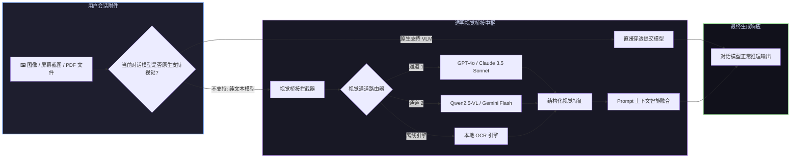

# 📦 @goodandready/dsh-vision-bridge

<div align="center">

<h3>DeepSeek Harness 通用视觉桥接、多模态转接器与 27 合 1 计算机视觉工具箱</h3>

<p align="center">
  <a href="https://www.npmjs.com/package/@goodandready/dsh-vision-bridge"></a>
  <a href="LICENSE"></a>
  <a href="https://github.com/topics/dsh-plugin"></a>
  <a href="https://nodejs.org"></a>
</p>

<p align="center">
  <a href="README.md"><b>🇬🇧 English</b></a> •
  <a href="README.ru.md"><b>🇷🇺 Русский</b></a> •
  <a href="README.zh.md"><b>🇨🇳 中文说明</b></a>
</p>

</div>

---

## ⚡ 插件概览

**`dsh-vision-bridge`** 是为 **DeepSeek Harness** 量身定制的全能多模态视觉处理中枢。

它彻底解决了两大核心场景痛点：
1. **通用多模态视觉桥接**：当用户向**纯文本大模型**（如 `deepseek-v4-flash`、`deepseek-chat`）发送图片、截图或 PDF 时，插件在请求发出前自动拦截附件，调度独立配置的视觉大模型（GPT-4o、Claude 3.5 Sonnet、Qwen2.5-VL、Gemini 2.0 Flash）提取高保真结构化图文描述并无缝融合至 Prompt 中，彻底杜绝 `does not support image input` 报错。
2. **27 项专属视觉工具矩阵**：为智能体赋予全套视觉感知工具（OCR、VQA、空间坐标定位、UI 原型分析、PDF 多页解析、图片对比及批量处理）。



---

## 🛠️ 27 项智能体计算机视觉工具清单

`dsh-vision-bridge` 向 `ctx.tools` 注册了 27 个专业工具：

| 工具名称 | 核心用途 | 关键参数 |
|---|---|---|
| `describe_image` | 全局图像语义描述与图文标注 | `image_path`, `detail_level` |
| `read_image` | 按自然阅读顺序提取图像内文字 | `image_path`, `language` |
| `vision_ocr` | 高精度云端 OCR 文字识别 | `image_path`, `detect_orientation` |
| `vision_ocr_local` | 100% 离线本地 OCR 引擎 | `image_path` |
| `vision_long_ocr` | 复杂排版与多栏长文档 OCR | `image_path`, `preserve_layout` |
| `vision_pdf_pages` | PDF 多页渲染提取与图文解析 | `pdf_path`, `pages`, `dpi` |
| `vision_describe_structured` | 提取结构化 JSON（物体、文字、颜色、层级） | `image_path`, `schema` |
| `vision_vqa` | 针对特定区域的视觉问答推理 | `image_path`, `question`, `bbox` |
| `vision_ground` | 空间坐标与 Bounding Box 定位 | `image_path`, `query` |
| `vision_crop` | 基于坐标或关键点动态裁剪局部图像 | `image_path`, `bbox`, `target_path` |
| `vision_detect` | 目标检测、数量统计与分类 | `image_path`, `categories` |
| `vision_compare` | 多图并排对比与语义差异分析 | `image_paths`, `aspects` |
| `vision_pixel_diff` | 像素级视觉回归差异比对 | `image_a`, `image_b`, `threshold` |
| `vision_ui_layout` | UI 线框图与组件层级结构解析 | `image_path`, `framework` |
| `vision_translate_image` | 图像内文字原地翻译与替换 | `image_path`, `target_lang` |
| `vision_colors` | 提取色板与主色调对比度分析 | `image_path`, `palette_size` |
| `vision_extract_foreground` | 前景主体抠图与背景去除 | `image_path`, `output_path` |
| `vision_trace` | 工程图纸与矢量线框轮廓追踪 | `image_path`, `smoothness` |
| `vision_html_screenshot` | 将 HTML/CSS 片段即时渲染为截图 | `html_content`, `viewport` |
| `vision_video_describe` | 视频关键帧提取与时间轴摘要 | `video_path`, `fps` |
| `vision_batch` | 多图并行批量分析调度 | `image_paths`, `task` |
| `vision_browser_snapshot` | 无头浏览器网页截图截屏 | `url`, `wait_selector` |
| `vision_browser_click` | 基于视觉坐标的浏览器元素点击 | `coordinate`, `element_text` |
| `vision_browser_navigate` | 视觉网页浏览导航 | `url` |
| `vision_present` | 视觉结果高亮渲染与格式化 | `image_path`, `highlights` |
| `vision_materialize` | 视觉资产持久化与缓存管理 | `asset_ref` |
| `vision_page_persist` | 跨会话视觉上下文状态保持 | `session_id`, `state` |

---

## 📦 安装指南

```bash
dsh plugin --profile web add @goodandready/dsh-vision-bridge
```

---

## 📄 开源协议

MIT © [GooDAnDReaDY](https://github.com/GooDAnDReaDY)
