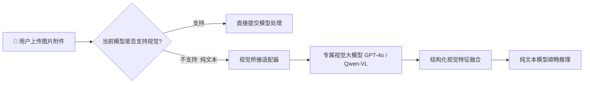

# 📦 @goodandready/dsh-vision-bridge

<div align="center">

<h3>DeepSeek Harness 通用视觉桥接与纯文本大模型多模态适配插件</h3>

<p align="center">
  <a href="https://www.npmjs.com/package/@goodandready/dsh-vision-bridge"></a>
  <a href="LICENSE"></a>
  <a href="https://github.com/topics/dsh-plugin"></a>
  <a href="https://nodejs.org"></a>
</p>

<p align="center">
  <a href="README.md"><b>🇬🇧 English</b></a> •
  <a href="README.ru.md"><b>🇷🇺 Русский</b></a> •
  <a href="README.zh.md"><b>🇨🇳 中文说明</b></a>
</p>

</div>

---

## ⚡ 插件概览

**`dsh-vision-bridge`** 解决用户向纯文本大模型（如 `deepseek-v4-flash`）发送图片导致的会话中断问题。自动调用独立视觉模型提取结构化图文描述并无缝拼接至 Prompt 中。



---

## 📦 安装指南

```bash
dsh plugin --profile web add @goodandready/dsh-vision-bridge
```

---

## 📄 开源协议

MIT © [GooDAnDReaDY](https://github.com/GooDAnDReaDY)
